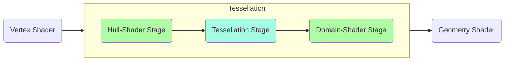

```mermaid
flowchart LR

classDef canProgram fill:#b0fba5
classDef fixed fill:#a5fbe3

Vertex("Vertex Shader")
Geometry("Geometry Shader")

HullShader("Hull-Shader Stage"):::canProgram
TessellationStage("Tessellation Stage"):::fixed
DomainShader("Domain-Shader Stage"):::canProgram

subgraph Tessellation
direction LR
HullShader --> TessellationStage --> DomainShader
end

Vertex --> Tessellation --> Geometry
```
